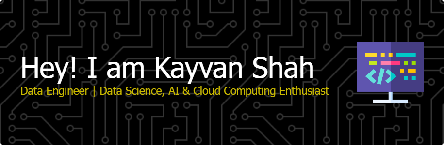

  <h2>Data &amp; ML Engineer building reliable data and ML systems</h2>
  
<strong>I design pipelines and models that stay correct under late data, scale, and real-world failure.</strong>

  
Currently working on audit analytics, agentic backends, and production forecasting pipelines.

    

## What I’m Known For
- Designing ingestion and modeling systems for messy, high-volume event data - Production ML and LLM workflows with evaluation, monitoring, and deployment hygiene - Resilient integrations handling rate limits, backfills, schema drift, and retries 

## Now
- Building a Google Workspace audit analytics pipeline with overlap-safe ingestion - Developing agentic backend workflows using LLMs - Writing about real-world data failures and system design tradeoffs 

_Pinned repositories below reflect the work above._

## Stack

                            

## GitHub Activity

     
     

 

     

 

 
    

## Open To
Open to Data Engineering, MLOps, and Platform roles. Best reached via LinkedIn or email.

---

  
  
  

  This <i>README</i> is generated <b>every 24 hours</b>! 
  Last refresh: 01:42:43 GMT+0000 (Coordinated Universal Time)

